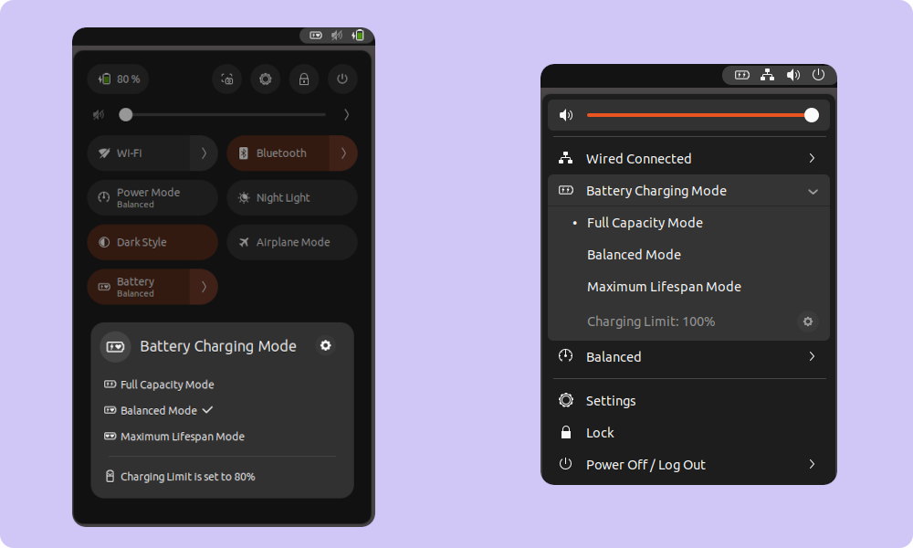
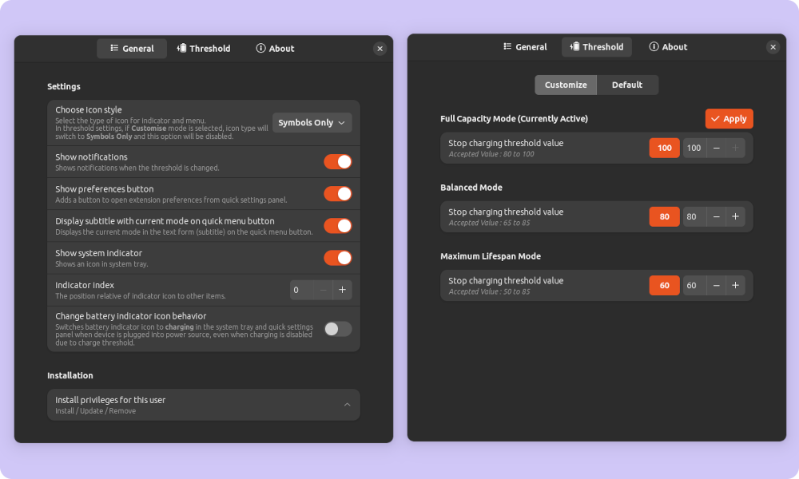

# Battery Health Charging

{: .important-title }
> Currently supported on Gnome Version:
> 
> `42, 43, 44, 45`

**Battery Health Charging is a Gnome Extension that provides a graphical user interface to a Gnome environment for setting charging limit (charging threshold) of a laptop.**
 
 
When users keep their laptop connected to AC adapter all the time, the battery is often in a state of high-power (98-100%) for an extended length of time which causes a reduction in battery life. To prevent reduction of battery life, the laptop manufacturers provides as option to limit the charging of a battery to level that prolongs battery life (charging threshold). Battery Health Charging extension provides a Graphical user interface, to set these charging limit / threshold.

This extension allows you to set 2 or 3 preset (depending on laptop) modes of threshold:
* **Full Capacity Mode:** Battery is charged to its full capacity for longer use on battery power (charger unplugged).

* **Balanced Mode:** Stops charging when battery level is around 80%. This mode is recommended when using the laptop on battery power during meetings or conferences.

* **Maximum Lifespan Mode:** Stops charging when battery level is  around  60%. This mode is recommended when the laptop is always powered by AC adapter.

{: .note }
The battery level at which the charger stops (charging threshold) may be at different on some laptop model.

## Quick Settings

    <b>Gnome 43 and above</b>
    <b>Gnome 42</b>

## Extension Preferences

{: .note }
Quick Settings and Extension Preferences may be different according on your device

